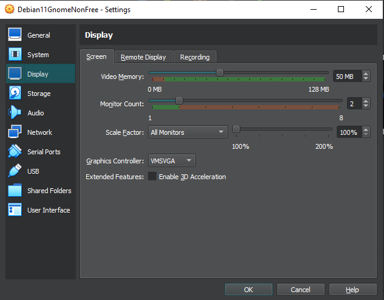

# Debian 11 asennus virtuaalikoneelle 19/1/2023

x lisätty 27.1 19.25

#### x) Tiivistelmä [Raportin kirjoittaminen](https://terokarvinen.com/2006/raportin-kirjoittaminen-4/)
-Toistettavuus
    Ympäristön kirjaus
    Laitteiston kirjaus
    Samassa ympäristössä ja raudalla pitäisi tulla aina sama lopputulos
    
-Täsmällisyys
    Täsmällisesti dokumentointi lopputulokseen olennaiset asiat
    Myös kellonajat
    Jos ei onnistu selvitys miksi
    
-Helppolukuisuus
    Vapaa tyyli kunhan siistiä luettavaa
    Huolellista ja oikeaoppista kieltä
    
Yleisesti huolellinen ja perusteellinen kirjaus

### Järjestelmä
    Host Windows10
    Intel(R) Core(TM) i7-8700K CPU @ 3.70GHz
    Ram 16,0 GB
    emolevy msi z370 (ms-7b61)
    SSD Samsung 860 EVO 1TB

#### Debian 

    [ISO]	debian-live-11.6.0-amd64-gnome+nonfree.iso (https://cdimage.debian.org/images/unofficial/non-free/images-including-firmware/current-live/amd64/iso-hybrid/)

#### Virtualbox

    Versio 7.0.6 - windows host (https://www.virtualbox.org/wiki/Downloads)
    
Virtualbox asennukseen ei muutoksia

Luodaan uusi virtuaalikone painamalla New->
Valitut asetukset
Expert mode
lisätty nimi
lisätty reitti ladattuun levyn näköistiedostoon

ram muistia 8192 MB
6cpu prosessoria(virtualisointi päällä järjestelmässä)
levytilaa 250 GB

Käynnistetty debian, ensimmäisestä valikosta valittu ensimmäinen vaihtoehto
testattu toimivuus firefoxilla, toimii

Järjestelmän kieli englanti 
Sijainti Helsinki
Näppäimistö suomi(winkeys)

Partitions -> erase disk ei muita muutoksia

Käyttäjän perustiedot
-> Install

## Kahden näytön käyttöönottaminen

Asetukset ->
    Display 
    
    

