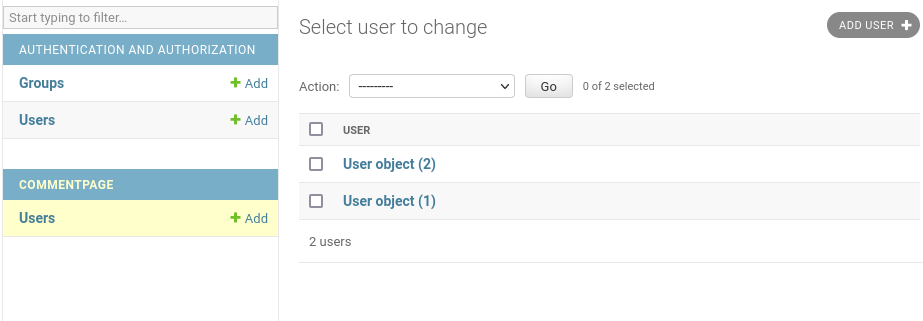

asennetaan kehitysympäristö djangolle

		sudo apt-get -y install virtualenv

tehdään uusi kansio env/ jolla on uusimmat paketit lib/site-packages, määritellään myös pythonin versioksi python3

		virtualenv --system-site-packages -p python3 env/

käytetään luomaamme virtuaaliympäristöä

		source env/bin/activate

komentokehotteen rivien alkuun tuli (env)

		
pip ei ole turvallinen paketinhallintaohjelma -> ei sudo käyttöä eikä käyttöä virtualenv ulkopuolella

alimman rivin mukaan django asennettiin onnistuneesti, mukana tuli myös paketit sqlparse ja asgiref

tehdään uusi django projekti ja kokeillaan sen toimivuus testiserverillä

		django-admin startproject comments
		cd comments/
		./manage.py runserver

päivitetään tietokannat

		./manage.py makemigrations
		./manage.py migrate

lisätään käyttäjä ja salasanageneraattorilla tehty salasana

		sudo apt-get install pwgen
		pwgen -s 20 1

		./manage.py createsuperuser
		asetettiin admin käyttäjälle nimi ja salasana, sähköposti tyhjäksi

admin käyttäjällä pääsi kirjautumaan sisään /admin osoitteessa, seuraavaksi lisätään uusi käyttäjä
jolle lisätään staff ja superuser asetukset

kirjaudutaan ulos aiemmin tehdyltä käyttäjältä ja kirjaudutaan uudelle käyttäjälle, sekin toimii.

tehdään uusi sovellus ja lisätään se comments/settings.py tiedoston INSTALLED_APPS listaan

		./manage.py startapp commentpage
		
		INSTALLED_APPS = [
		    'django.contrib.admin',
		    'django.contrib.auth',
		    'django.contrib.contenttypes',
		    'django.contrib.sessions',
		    'django.contrib.messages',
		    'django.contrib.staticfiles',
		    'commentpage',
		]

luodaan skripti joka luo tietokantataulun uudelle sovellukselle

		micro commentpage/models.py 

		from django.db import models
		
		class User(models.Model):
		    name = models.CharField(max_length=300)
		    
		./manage.py makemigrations
		./manage.py migrate

rekisteröidään tietokanta adminsivulle

		micro commentpage/admin.py
		

		from django.contrib import admin
				from . import models
				
				admin.site.register(models.User)		

		./manage.py runserver

USERS taulu näkyy ja siihen pystyy lisäämään 

ManyToOne

tavoitteena lisätä käyttäjälle mahdollisuus tehdä kommentti, ensin muokkasin models.py tiedostoa ja lisäsin sinne kommentin
kommentille annoin arvon teksti ja yhdistin käyttäjän siihen 

		from django.db import models
			
			class User(models.Model):
			    name = models.CharField(max_length=300)
			
			    def __str__(self):
			        return self.name
			
			class Comment(models.Model):
			    text = models.CharField(max_length=1000)
			    user = models.ForeignKey(User, on_delete=models.CASCADE)
				
			    def __str__(self):
			        return self.text

lisäsin myös admin.py tiedostoon Comment rekisteröinnin

		from django.contrib import admin
		from . import models
		
		admin.site.register(models.User)
		admin.site.register(models.Comment)

nyt tietokantaan voi lisätä kommentin johon on liitettynä käyttäjä, jos käyttäjän poistaa poistuvat siihen liittyvät kommentitkin.

		
				
Lähteet: https://terokarvinen.com/2022/django-instant-crm-tutorial/ ,
https://docs.djangoproject.com/en/4.1/topics/db/examples/many_to_one/
