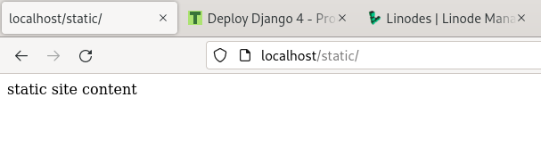
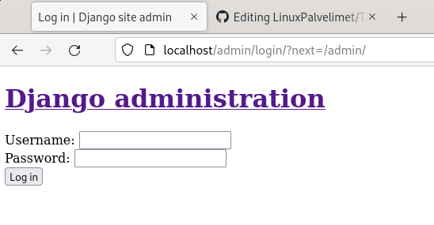
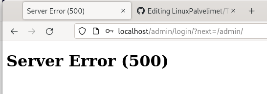

# h11 prod

a) Tee Djangon tuotantoasennus.

en saanut apache2 käynnistettyä, kun yritin käynnistää sitä uudelleen sain viestin

	Job for apache2.service failed because the control process exited with error code.
	See "systemctl status apache2.service" and "journalctl -xe" for details.

ensimmäisellä komennolla sain tulosteen

	● apache2.service - The Apache HTTP Server
	     Loaded: loaded (/lib/systemd/system/apache2.service; enabled; vendor preset: enabled)
	     Active: failed (Result: exit-code) since Thu 2023-03-02 12:32:42 EET; 12s ago
	       Docs: https://httpd.apache.org/docs/2.4/
	    Process: 3158 ExecStart=/usr/sbin/apachectl start (code=exited, status=1/FAILURE)
	        CPU: 11ms

journalctl-xe ei sisältänyt omaan silmään mitään hyödyllistä.

tarkistin apache2 error logit mutta molemmat olivat tyhjiä

kokeilin komentoa sudo apachectl configtest, jonka tulosteesta muistin, että T6 b osassa 
olin tehnyt tarkoituksella syntaksivirheen joka oli näköjään jäänyt korjaamatta silloin.
No, ainakin hyvää kertausta apachen virheilmoituksista.

kun sain apachen toimimaan tein uuden hakemiston publicwsgi/eeroh/static ja loin sinne index.html tiedoston johon lisäsin tekstiä.

	mkdir -p publicwsgi/eeroh/static/
	echo "static site content" | tee publicwsgi/eeroh/static/index.html

loin conf tiedoston hakemistoon /etc/apache2/sites-available/ ja lisäsin sinne tekstin:

	<VirtualHost *:80>
		Alias /static/ /home/eero/publicwsgi/eeroh/static/
		<Directory /home/eero/publicwsgi/eeroh/static/>
			Require all granted
		</Directory>
	</VirtualHost>
	
	sudo a2ensite eeroh.conf
	sudo a2dissite 000-default.conf
	sudo a2dissite 000-default.conf

tuloste päättyi Syntax OK joten voidaan jatkaa

kokeilin static sivua komennolla curl http://localhost/static/, sain virheilmoituksen You don't have permission to access this resource.
hetken tutkailtuani tekemisiäni oletan sen johtuneen conf tiedostoon kirjoitetusta väärästä käyttäjästä.
vaihdoin nimen oikeaan ja nyt samalla komennolla saan takaisin aiemmin sivulle lisäämäni tekstin.

Djangon asennus VirtualEnvissä

käynnistetään aiemmin asentamani virtualenv publicwsgi hakemistossa

	~/publicwsgi> virtualenv -p python3 --system-site-packages env
	~/publicwsgi> ls
	eeroh/  env/

env/ hakemisto luotu onnistuneesti

	source env/bin/activate
	
tämä ei toimi, koska käytän fish terminal emulaattoria bashin sijaan.
sain vastaavan virheilmoituksen:

	env/bin/activate (line 49): Unsupported use of '='. In fish, please use 'set VIRTUAL_ENV '/home/eeros/publicwsgi/env''.
	from sourcing file env/bin/activate
	source: Error while reading file “env/bin/activate”
	
tutkittuani virheilmoitusta ja envin hakemistoja sain selville että 
virtualenvissä on valmiiksi fish aktivointiskripti joten sain envin käyttöön komennoilla:

	set VIRTUAL_ENV '/home/eeros/publicwsgi/env'
	source /home/eeros/publicwsgi/env/bin/activate.fish

tarkistetaan että pip on env/ hakemistossa

	which pip
	/home/eeros/publicwsgi/env/bin/pip

oikealta näyttää.

tein requirements.txt nimisen tiedoston johon lisäsin tekstin "django"
asensin tiedoston sisältävät paketit eli vain djangon komennolla pip install -r requirements.txt

asennustietojen viimeisellä rivillä lukee djangon versio ja muut paketit jotka asentuivat sen mukana

	Successfully installed asgiref-3.6.0 django-4.1.7 sqlparse-0.4.3

editoidaan eeroh.conf tiedostoa hakemistossa /etc/apache2/sites-available/ 

	Define TDIR /home/eeros/publicwsgi/eeroh
	Define TWSGI /home/eeros/publicwsgi/eeroh/wsgi.py 
	Define TUSER eeros
	Define TVENV /home/eeros/publicwsgi/env/lib/python3.9/site-packages
	
	<VirtualHost *:80>
	        Alias /static/ ${TDIR}/static/
	        <Directory ${TDIR}/static/>
	                Require all granted
	        </Directory>
	
	        WSGIDaemonProcess ${TUSER} user=${TUSER} group=${TUSER} threads=5 python-path="${TDIR}:${TVENV}"
	        WSGIScriptAlias / ${TWSGI}
	        <Directory ${TDIR}>
	             WSGIProcessGroup ${TUSER}
	             WSGIApplicationGroup %{GLOBAL}
	             WSGIScriptReloading On
	             <Files wsgi.py>
	                Require all granted
	             </Files>
	        </Directory>
	
	</VirtualHost>
	
	Undefine TDIR
	Undefine TWSGI
	Undefine TUSER
	Undefine TVENV
	
asennetaan WSGI moduuli, jotta apache ymmärtää mitä WSGI komennot tarkoittavat

	sudo apt-get -y install libapache2-mod-wsgi-py3

testataan syntaxi

	/sbin/apache2ctl configtest

taas palautteena syntax ok joten voidaan jatkaa, käynnistetään apache uudelleen.

	sudo systemctl restart apache2

testataan: 

	curl -s localhost | grep title
	<title>404 Not Found</title>

jokin on pielessä, takaisin selvittelemään sitä. tässä kohtaa sain myös toisen 403 alkuisen virheilmoituksen joka johtui kirjoitusvirheestä sites-available conf tiedostossa

poistin aiemman django sovelluksen ja tein sen uudelleen, raporttia kelaillessani tämä vaihe oli nähtävästi unohtunut aiemmin. en kuitenkaan aluksi pystynyt tehdä projektia koska publicwsgi hakemisto sisälsi jo hakemiston eeroh, joten sain virheilmoituksen 'CommandError: '/home/eeros/publicwsgi/eeroh' already exists'

	cd publicwsgi/
	rm -r eeroh
	django-admin startproject eeroh
	
nyt tulee oikeanlainen tuloste myös localhostilta, tarkistin samalla että palvelin on Apache
	
	(env) eeros@eero-virtualbox ~/p/eeroh> curl -s localhost | grep title
	<title>The install worked successfully! Congratulations!</title>
	(env) eeros@eero-virtualbox ~/p/eeroh> curl -sI localhost|grep Server
	Server: Apache/2.4.54 (Debian)
	
Poistetaan DEBUG tila pois käytöstä editoimalla publicwsgi/eeroh/eeroh hakemistossa olevaa settings.py tiedostoa

	cd publicwsgi/eeroh/
	micro eeroh/settings.py 
	
asetuksia ennen on myös kommentoitu DEBUG asetuksen tärkeydestä. 
	
	# SECURITY WARNING: don't run with debug turned on in production!
	DEBUG = False
	ALLOWED_HOSTS = ["localhost"]

käynnistetään projekti uudelleen
	
	sudo systemctl restart apache2

localhost/admin sivusto näyttää nyt tältä.

kirjautuessa tulee näkymä:

Static assets

lisätään import os
STATIC_ROOT = os.path.join(BASE_DIR, 'static/')
settings.py importtien kohdalle

	source /home/eeros/publicwsgi/env/bin/activate.fish
	./manage.py collectstatic

virheilmoitus:

	File "/home/eeros/publicwsgi/eeroh/eeroh/settings.py", line 15, in <module>
	    STATIC_ROOT = os.path.join(BASE_DIR, 'static/')
	NameError: name 'BASE_DIR' is not defined

sirretään importti määritellyn BASE_DIR alle

tiedoston rivit 13-19

>from pathlib import Path

># Build paths inside the project like this: BASE_DIR / 'subdir'.
>BASE_DIR = Path(__file__).resolve().parent.parent

>import os
>STATIC_ROOT = os.path.join(BASE_DIR, 'static/')

	./manage.py collectstatic
	130 static files copied to '/home/eeros/publicwsgi/eeroh/static'.
	
lähteet: https://terokarvinen.com/2022/deploy-django/
