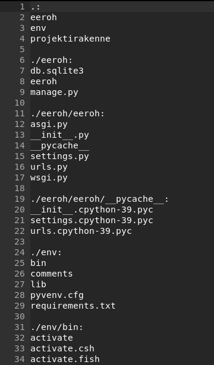
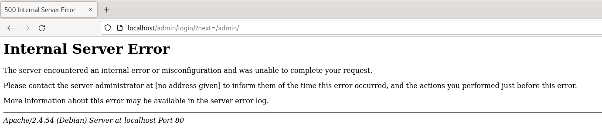
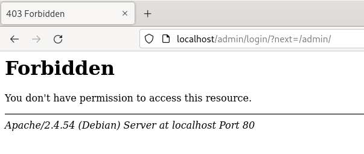
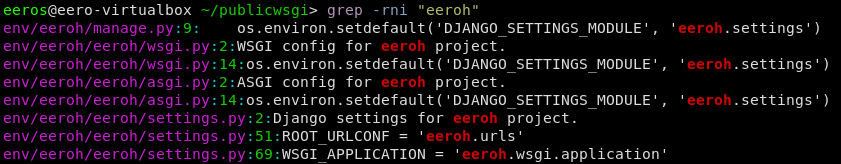

# h12 vianselvitys

6.3 10:00

Aloitin tehtävän muistelemalla viimeksi tekemäni djangoprojektin tiedostorakennetta, komennolla `ls -R > projektirakenne` komento listaa alihakemistot tekstitiedostoon jonka nimen voi itse määritellä.

a)Kirjoitusvirhe Python-tiedostossa - publicwsgi/eeroh/eeroh/settings.py

kirjoitin ensimmäiselle riville tekstiä, se ei aiheuttanut muutoksia joten seuraavaksi päätin rikkoa ensimmäisen import komennon

> frm pathlib import Path

kokeilin päivittää projektin `touch wsgi.py` komennolla mutta mitään ei tapahtunut, todennäköisesti niin iso muutos, että koko projekti pitää käynnistää uudelleen.
käynnistin projektin uudelleen komennolla `sudo systemctl restart apache`. kellonaika (10.43.31) nyt localhost/admin näyttää internal server error.

kaivoin tarkan ajan history -t systemctl restart apache2, fish komento mutta bashilla varmaan samantyylinen

/var/log/apache2/error.log tiedostosta löytyi hyvä virheraportti

>[Mon Mar 06 10:43:37.588275 2023] [wsgi:error] [pid 10004:tid 140476280764160] [remote 127.0.0.1:53434]   File "/home/eeros/publicwsgi/eeroh/eeroh/settings.py", line 13
>[Mon Mar 06 10:43:37.588282 2023] [wsgi:error] [pid 10004:tid 140476280764160] [remote 127.0.0.1:53434]     frm pathlib import Path
>[Mon Mar 06 10:43:37.588294 2023] [wsgi:error] [pid 10004:tid 140476280764160] [remote 127.0.0.1:53434]         ^
>[Mon Mar 06 10:43:37.588300 2023] [wsgi:error] [pid 10004:tid 140476280764160] [remote 127.0.0.1:53434] SyntaxError: invalid syntax

lopussa näyttää selkeästi tiedostosijainnin, rivin ja että virhe on syntaxissa.

korjasin virheen ja jatkoin b-osaan.

unohdin dokumentoida testauksen toimivuuden, b kohdan korjattua kuitenkin projekti oli alkupisteessä.

b)Django-projektikansio väärässä paikassa -  publicwsgi/eeroh/manage.py

10:55

siirsin projektikansion env tiedostoon

		eeros@eero-virtualbox ~> mv publicwsgi/eeroh/ publicwsgi/env/
		eeros@eero-virtualbox ~> ls publicwsgi/env/
		bin/  comments/  eeroh/  lib/  pyvenv.cfg  requirements.txt

error.log oli täynnä virheilmoituksia joissa luki client denied by server configuration.
suurin osa osoitti /home/eeros/publicwsgi/eeroh/static, mutta myös yksi /home/eeros/publicwsgi/eeroh

>
[Mon Mar 06 10:57:58.334644 2023] [authz_core:error] [pid 11493:tid 140615926224640] [client 127.0.0.1:37450] AH01630: client denied by server configuration: /home/eeros/publicwsgi/eeroh/static, referer: http://localhost/admin/login/?next=/admin/
[Mon Mar 06 10:57:58.337547 2023] [authz_core:error] [pid 11493:tid 140615917831936] [client 127.0.0.1:37434] AH01630: client denied by server configuration: /home/eeros/publicwsgi/eeroh/static, referer: http://localhost/admin/login/?next=/admin/
[Mon Mar 06 10:57:58.339121 2023] [authz_core:error] [pid 11493:tid 140615909439232] [client 127.0.0.1:37434] AH01630: client denied by server configuration: /home/eeros/publicwsgi/eeroh/static, referer: http://localhost/admin/login/?next=/admin/
[Mon Mar 06 10:57:58.343465 2023] [authz_core:error] [pid 11493:tid 140615543154432] [client 127.0.0.1:37434] AH01630: client denied by server configuration: /home/eeros/publicwsgi/eeroh/static, referer: http://localhost/admin/login/?next=/admin/
[Mon Mar 06 10:57:58.344787 2023] [authz_core:error] [pid 11493:tid 140615551547136] [client 127.0.0.1:37434] AH01630: client denied by server configuration: /home/eeros/publicwsgi/eeroh/static, referer: http://localhost/admin/login/?next=/admin/
[Mon Mar 06 11:00:46.798642 2023] [mpm_event:notice] [pid 11491:tid 140615963114816] AH00492: caught SIGWINCH, shutting down gracefully
[Mon Mar 06 11:00:46.938366 2023] [mpm_event:notice] [pid 12046:tid 140294476029248] AH00489: Apache/2.4.54 (Debian) mod_wsgi/4.7.1 Python/3.9 configured -- resuming normal operations
[Mon Mar 06 11:00:46.938447 2023] [core:notice] [pid 12046:tid 140294476029248] AH00094: Command line: '/usr/sbin/apache2'
[Mon Mar 06 11:00:51.868984 2023] [authz_core:error] [pid 12049:tid 140294455924480] [client 127.0.0.1:59758] AH01630: client denied by server configuration: /home/eeros/publicwsgi/eeroh

viimeinen rivi taas antaa oleellisen tiedon virheestä, serverin konfiguraatio estää pääsyn. 

etsin tiedostoa publicwsgi hakemistosta. en tiedä miten olisin toiminut jos en olisi tiennyt virheen aiheuttajaa etukäteen mutta ainakin virheen näkee tästä selvästi.

siirsin tiedoston takaisin mv komennolla ja testasin.

	eeros@eero-virtualbox ~/publicwsgi> mv env/eeroh/ .
	eeros@eero-virtualbox ~/publicwsgi> ls
	eeroh/  env/  projektirakenne
	

	curl localhost | grep title
	% Total    % Received % Xferd  Average Speed   Time    Time     Time  Current
	                                 Dload  Upload   Total   Spent    Left  Speed
	100   274  100   274    0     0   267k      0 --:--:-- --:--:-- --:--:--  267k
	<title>Not Found</title>

komento antoi ylimääräistä statistiikkaa jonka curl lisää jos tulostus ei mene terminaaliin, 
tämän saa pois lisäämällä curl perään -s lyhenne silent. poistaa ylimääräiset tulostukset

title Not Found - takaisin alkuasemissa

c) Projektikansiolla väärät oikeudet
11:41

tehtävänannossa annetut komennot teroco esimerkkiprojektiin, muuttavat hakemiston oikeuksia
('chmod ugo-rwx teroco/', 'chmod u+rx teroco/')

[chmod komennot](https://www.howtogeek.com/437958/how-to-use-the-chmod-command-on-linux/)

chmod komennolle kerrotaan kuka mitä ja mitkä asetukset

kuka:
u - User, meaning the owner of the file.
g - Group, meaning members of the group the file belongs to.
o - Others, meaning people not governed by the u and g permissions.
a - All, meaning all of the above.

mitä
- poistaa
+ lisää

mitkä asetukset:
r - The file can be opened, and its content viewed.
w - The file can be edited, modified, and deleted.
x - If the file is a script or a program, it can be run (executed).
rwx means full permissions have been granted. The read, write, and execute indicators are all present.

chmod ugo-rwx teroco/ -> poistaa kaikki oikeudet kaikilta
chmod u+rx teroco/ -> lisää käyttäjälle oikeudet avata ja toistaa skriptejä mutta ei muokata

kokeillaan itse

	chmod a-rwx eeroh/
	curl -s localhost | grep title
	<title>403 Forbidden</title>

>[Mon Mar 06 11:32:59.338752 2023] [mpm_event:notice] [pid 12046:tid 140294476029248] AH00492: caught SIGWINCH, shutting down gracefully
[Mon Mar 06 11:32:59.439118 2023] [mpm_event:notice] [pid 15198:tid 140501378456896] AH00489: Apache/2.4.54 (Debian) mod_wsgi/4.7.1 Python/3.9 configured -- resuming normal operations
[Mon Mar 06 11:32:59.439196 2023] [core:notice] [pid 15198:tid 140501378456896] AH00094: Command line: '/usr/sbin/apache2'
[Mon Mar 06 11:53:16.324184 2023] [core:error] [pid 15201:tid 140500719888128] (13)Permission denied: [client 127.0.0.1:55158] AH00035: access to /admin/login/ denied (filesystem path '/home/eeros/publicwsgi/eeroh/eeroh') because search permissions are missing on a component of the path
[Mon Mar 06 11:53:16.474826 2023] [core:error] [pid 15201:tid 140500711495424] (13)Permission denied: [client 127.0.0.1:55158] AH00035: access to /favicon.ico denied (filesystem path '/home/eeros/publicwsgi/eeroh/eeroh') because search permissions are missing on a component of the path, referer: http://localhost/admin/login/?next=/admin/
[Mon Mar 06 11:53:25.908868 2023] [core:error] [pid 15201:tid 140500694710016] (13)Permission denied: [client ::1:49626] AH00035: access to / denied (filesystem path '/home/eeros/publicwsgi/eeroh/eeroh') because search permissions are missing on a component of the path
[Mon Mar 06 11:53:55.408884 2023] [core:error] [pid 15200:tid 140501349959424] (13)Permission denied: [client ::1:60194] AH00035: access to / denied (filesystem path '/home/eeros/publicwsgi/eeroh/eeroh') because search permissions are missing on a component of the path
[Mon Mar 06 11:54:46.808206 2023] [core:error] [pid 15200:tid 140501256759040] (13)Permission denied: [client ::1:54130] AH00035: access to / denied (filesystem path '/home/eeros/publicwsgi/eeroh/eeroh') because search permissions are missing on a component of the path
[Mon Mar 06 11:55:04.538082 2023] [core:error] [pid 15201:tid 140500686317312] (13)Permission denied: [client ::1:35528] AH00035: access to / denied (filesystem path '/home/eeros/publicwsgi/eeroh/eeroh') because search permissions are missing on a component of the path
[Mon Mar 06 11:55:55.324446 2023] [core:error] [pid 15201:tid 140500560492288] (13)Permission denied: [client ::1:48570] AH00035: access to / denied (filesystem path '/home/eeros/publicwsgi/eeroh/eeroh') because search permissions are missing on a component of the path

error.log tiedostosta huomataan että virhe johtuu oikeuksista, oletan että tämä johtuu chmodin r oikeuksien poistamisesta koska tässä pyritään vain lukemaan tietoa.

lisätään r oikeudet takaisin

	chmod a+r eeroh/
	curl -s localhost | grep title
	<title>403 Forbidden</title>

Vaikkakin sama, error.logiin vain yksi virheilmoitus tällä kertaa

>[Mon Mar 06 12:09:10.910705 2023] [core:error] [pid 15200:tid 140501223188224] (13)Permission denied: [client ::1:57318] AH00035: access to / denied (filesystem path '/home/eeros/publicwsgi/eeroh/eeroh') because search permissions are missing on a component of the path

lisätään kirjoitusoikeudet, oletan että virhe johtuu x oikeuksista joten vieläkään ei pitäisi toimia

	chmod a+w eeroh/
	curl -s localhost | grep title
	<title>403 Forbidden</title>

sama virhe edelleen, myös error logissa sama viesti

>[Mon Mar 06 12:14:21.998760 2023] [core:error] [pid 15201:tid 140501214795520] (13)Permission denied: [client ::1:47584] AH00035: access to / denied (filesystem path '/home/eeros/publicwsgi/eeroh/eeroh') because search permissions are missing on a component of the path

lisätään vihdoin myös x oikeudet eli oikeus suorittaa skriptejä tai ohjelmia jos sellaisia on.

	chmod a+x eeroh/
	curl -s localhost | grep title
	  <title>Not Found</title>

kokeillaan vielä poistaa muut oikeudet paitsi x

	chmod a-rw eeroh/
	curl -s localhost | grep title
	  <title>Not Found</title>

sivu toimii niin kuin aiemmin, mutta error.logiin tulee samat monta virheilmoitusta kuin alussa jolloin kaikki oikeudet poistettiin.

palautetaan kaikki oikeudet 

	chmod a+rwx eeroh/

yksi tehtävänannon kohta meinasi unohtua jossa projektilla on vain lukemis ja skriptioikeudet eli poistetaan write.
oletus on että virheitä ei tapahdu, koska käytössä ei ole tarvetta muokata tiedostoja.

	chmod a-w eeroh/
	curl -s localhost | grep title
	  <title>Not Found</title>

selaimen tulostus on sama, eikä error.logiin tullut virheitä. lisätään w oikeudet ja siirrytään seuraavaan tehtävään.
	  
d) /etc/apache2/sites-available/eeroh.conf

>Define TDIR /home/eeros/publicwsgi/eeroh
>>Define TWSGI /home/eeros/publicwsgi/eero/eeroh/wsgi.py
>Define TUSER eeros
>Define TVENV /home/eeros/publicwsgi/env/lib/python3.9/site-packages
>
><VirtualHost *:80>
>        Alias /static/ ${TDIR}/static/
>        <Directory ${TDIR}/static/>
>                Require all granted
>        </Directory>
>
>        WSGIDaemonProcess ${TUSER} user=${TUSER} group=${TUSER} threads=5 python-path="${TDIR}:${TVENV}"
>        WSGIScriptAlias / ${TWSGI}
>        <Directory ${TDIR}>
>             WSGIProcessGroup ${TUSER}
>             WSGIApplicationGroup %{GLOBAL}
>             WSGIScriptReloading On
>             <Files wsgi.py>
>                Require all granted
>             </Files>
>        </Directory>
>
></VirtualHost>
>
>Undefine TDIR
>Undefine TWSGI
>Undefine TUSER
>Undefine TVENV

e) Apachen WSGI-moduli puuttuu ('sudo apt-get purge libapache2-mod-wsgi-py3' tms)

f)

lähteet: https://fishshell.com/docs/current/cmds/history.html
https://www.howtogeek.com/437958/how-to-use-the-chmod-command-on-linux/
https://serverfault.com/questions/488698/testing-if-a-server-is-up-with-curl-and-grep-grep-adds-headings
