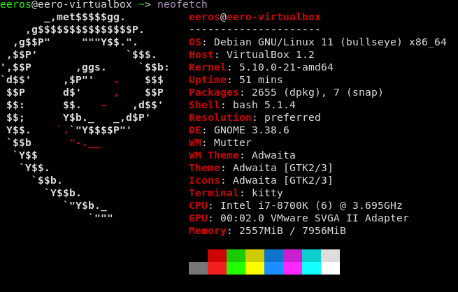
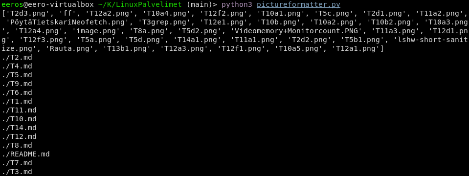
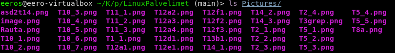

# T14 Uusi komento

Ympäristö:

## a) Tee Linuxiin uusi komento Bashilla. Komennon tulee toimia kaikilla käyttäjillä, työhakemistosta riippumatta.
13.3 10.45

muokkasin aiemmin tekemääni gitcommit skriptiä ottamaan vastaan ensimmäisen sille annetun argumentin ja lisäävän sen commit viestiksi, if kohdassa -eq tarkoittaa equals eli vertaa onko annettujen argumenttien määrä 0.

	#!/bin/bash
	
	if [$# -eq 0]; then
		echo "Add commit message"
	else
		git pull origin main
		git add .
		git commit -m "$1"
		git push origin main

siirsin sen /usr/local/bin/ ja annoin käyttäjille oikeudet suorittaa tiedoston skriptinä

	sudo cp gitcommit.sh /usr/local/bin/
	cd /usr/local/bin/
	sudo chmod a+x gitcommit.sh

kokeilin suorittaa skriptiä mutta sain sillä virheilmoituksen:

	gitcommit.sh
	/usr/local/bin/gitcommit.sh: line 10: syntax error: unexpected end of file
	
if lausekkeen lopusta puuttui fi joka sulkee sen. 
poistin skriptin hetkeksi pois työskentelyrepositorysta jotta voin varmistua että ajan oikeaa /usr/local/bin/ skriptiä	

	eeros@eero-virtualbox ~/K/LinuxPalvelimet (main)> rm gitcommit.sh
	gitcommit.sh
	/usr/local/bin/gitcommit.sh: line 3: [1: command not found

if lausekkeessa pitää näköjään olla sulkujen sisällä välit ennen ja jälkeen argumentteja, lisätään ne ja skripti toimii:

	#!/bin/bash
	
	if [ $# -eq 0 ]; then
		echo "Add commit message"
	else
		git pull origin main
		git add .
		git commit -m "$1"
		git push origin main
	fi

tallennetaan tämä raportti ja kokeillaan committaa se skriptillä.  
	gitcommit.sh T14a

## b) ja c)
suunnittelin tehdä skriptin jolla päivitän kaikkien kuvakansion kuvien nimet samaan formaattiin. *Kävin Pythonista kurssin jonkun aikaa sitten ja hyödynsin chatgpt:tä sen muistelemiseen*

	import os
	
	picture_files = os.listdir("Pictures")
	mddir = "."
	
	print(picture_files)
	
	for filename in os.listdir(mddir):
	    if filename.endswith(".md"):
	        md_files = os.path.join(mddir, filename)
	        print(md_files)

nyt saadaan kaikki tarvittavat tiedostot projektikansiosta.

avataan markdown tiedosto ja etsitään tiedostoista regexin avulla kuvien linkkaukset ja tulostetaan ne.

    with open(md_files, "r") as f:
        contents = f.read()

    pattern = r"!\[.*\]\((.*)\)"
    pictures = re.findall(pattern, contents)
	

nimenvaihtamisosion tein ensin print komennolla jotta pystyin tarkistamaan toiminnan. 
loopissa käydään läpi jokainen kuva aiemmin määritetyssä pictures listassa

	for picture in pictures:
	        picname = pic1 + "_" + str(pictures.index(picture)+1)
	        old_name = picture
	        new_name = "Pictures/" + f"{picname}.png"
	        print("in file: " + filename + ", old name: " + old_name)
	        print("new name: " + new_name)
13.3 13:50	
en vielä saanut koodia päivittämään markdown tiedostojen nimiä joten koodi päättyy virheilmoitukseen,

	Traceback (most recent call last):
	  File "/home/eeros/Koulu/pictureformatter/LinuxPalvelimet/pictureformatter.py", line 34, in <module>
	    os.rename(old_name, new_name)
	FileNotFoundError: [Errno 2] No such file or directory: 'Pictures/T2d1.png' -> 'Pictures/T2_2.png'

kuvien nimet kuitenkin päivittyvät oikeaan formaattiin

tässä vielä koko koodi tämänhetkisessä tilassaan

	import os
	import re
	
	picture_files = os.listdir("Pictures")
	mddir = "."
	
	for filename in os.listdir(mddir):
	    if filename.endswith(".py") or filename.endswith(".git" or filename.endswith(".sh")):
	        continue
	
	    if filename.endswith(".md"):
	        md_files = os.path.join(mddir, filename)
	        pic1 = filename[:-3]
	    
	
	    #Read the file
	    with open(md_files, "r") as f:
	        contents = f.read()
	
	    #find all the pictures with regex
	    pattern = r"!\[.*\]\((.*)\)"
	    pictures = re.findall(pattern, contents)
	
	    # Loop through picures and rename them
	    for picture in pictures:
	        picname = pic1 + "_" + str(pictures.index(picture)+1)
	        old_name = picture
	        new_name = "Pictures/" + f"{picname}.png"
	        
	        print("in file: " + filename + ", old name: " + old_name)
	        print("new name: " + new_name)
	
	        contents = contents.replace(picture, new_name)
	        os.rename(old_name, new_name)

	
Lähteet:  
	https://devdocs.io/python~3.11/,
