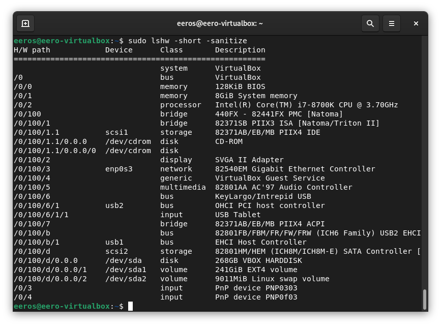

# Linux Palvelimet Tehtävä 2 "Komentaja Pingviini"

23.01.2023 - 11.34

### a) Micro. Asenna micro-editori

11:44 ajauduin kierteeseen tutkiakseni vaihtoehtoja terminal emulaattoreista ja komentotulkeista, päätin 
kuitenkin pysyä tehtävässä ja jatkaa niiden kanssa joskus toiste. Asensin micron komennolla 

    sudo apt-get install micro

### b) Rauta. Listaa testaamasi koneen rauta (‘sudo lshw -short -sanitize’)
11.47
asensin lshw komennolla

    sudo apt-get install lshw
    
Sen jälkeen ajoin komennon    
    
    sudo lswh -short -sanitize

-short formatoi tiedot pienempään tilaan ja järjestää ne raudan polun(hardware path) mukaan
-sanitize poistaa yksityiset tiedot kuten sarjanumerot

### c) Apt. Asenna kolme itsellesi uutta komentoriviohjelmaa
#### ohjelma 1 bash-completion, asennus komennolla:

    sudo apt-get install bash-completion
    
#### ohjelma 2 scrot, tavoitteena oli pystyä ottamaan kuvankaappaus konsolista yhdellä komennolla. Asennus:
    
    sudo apt-get install scrot
    
Ohjeiden mukaan tavoitteeni onnistuisi komennolla scrot -u , mutta itselläni tämä antaa errorin 
    
    X Error of failed request:  BadDrawable (invalid Pixmap or Window parameter)
    
13.24 tehtävän aika rupeaa loppumaan joten siirryn tekemään loppuja tehtäviä.

#### ohjelma 3 tldr, sama kuin man yksinkertaisimmilla esimerkeillä (asennus npm joten asennetaan ensin se)

    sudo apt install npm
    sudo npm install -g tldr
    
###
    
