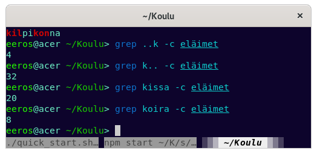

# Tehtävä 3 Vapaus

### a) Kolmen ohjelman lisenssit.

## ohjelma 1 bash-completion  https://github.com/scop/bash-completion
  -GNU General Public License v2.0
## ohjelma 2 scrot https://github.com/dreamer/scrot
  -MIT lisenssi
## ohjelma 3 tldr https://github.com/tldr-pages/tldr/blob/main/LICENSE.md
  -MIT lisenssi

Kaikki lisenssit ovat vapaita lisenssejä ja löytyvät linkatuilta github sivuilta. Jokaisen ohjelman lähdekoodi on
vapaana kaikille ja niiden muokkaus, käyttö(myös kaupallinen) ja jakaminen on rajaamatonta.

b)
## tein tekstitiedoston joka sisälsi kissoja koiria ja kilpikonnia

yhteensä sanoja joissa kahden satunnaisen kirjaimen jälkeen k on 4 kappaletta

kaikkia k:lla alkavia on 32 kappaletta

c) putkitus     

    sudo grep "eeros" auth.log | grep "npm"
   
etsii auth.log tiedostosta rivit joissa on sekä eeros että npm
