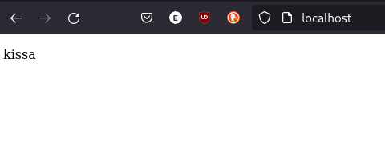

# T5 Hello Web

#### a) Vaihda Apachen esimerkkisivu
1.2 22:00
nettisivun index.html tiedosto löytyi /var/www/html, avasin sen microlla ja muokkasin sen näyttämään tekstin kissa.
Tallentaessa micro tarvitsi sudo oikeudet ja sallin ne

####  b) Laita käyttäjien kotisivut
22.10

Tehdään uusi käyttäjä 
      
    sudo adduser eerosav
    
Lisätään käyttäjien kotisivut ja käynnistetään apache uudestaan
    
    sudo a2enmod userdir
    systemctl restart apache2
    
    
vaihdetaan uuteen käyttäjään, tehty public_html kansio kotihakemistoon.

    su - eerosav
    mkdir public_html

käyttäjän kotisivut avaessa näyttää nyt tältä:

#### c) Tee uusi käyttäjä. Kirjaudu ulos omastasi ja sisään uutena käyttäjänä. Tee uudellekin käyttäjälle kotisivu.
22:51

    sudo adduser testuser
    su  - testuser
    mkdir public_html
    

#### d) Tee validi HTML5 sivu
    
    touch public_html/home.html
    micro public_html/home.html
    

    

Lähteet:
https://terokarvinen.com/2008/install-apache-web-server-on-ubuntu-4/
