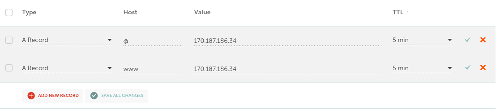

# T8 Say my name

### a)  Vuokraa domainnimi ja aseta se osoittamaan virtuaalipalvelimeesi.
13.2 12:08
vuokrasin domainnimen eerosavolainen.com osoitteesta namecheap.com, nimi maksoi vuodeksi 6.70€

Autorenew päälle.
Domain privacy päälle.
PremiumDNS ei tarvitse.

Vuokrattuani domainin menin sen asetuksiin ja sieltä Advanced DNS valikkoon

A Record sekä @ että www osoitteelle ohjaamaan aiemmassa tehtävässä vuokraamani palvelimen ip-osoitteeseen

### b) Tutki oman nimesi tietoja 'host' ja 'dig' -komennoilla. Analysoi tulokset.
12:30

oikea ip osoite

		host www.eerosavolainen.com
		www.eerosavolainen.com has address 170.187.186.34

jostain syystä @ näyttää eri osoitteeseen

		host eerosavolainen.com
		eerosavolainen.com has address 192.64.119.119

komennolla 'dig eerosavolainen.com' sain:

		; <<>> DiG 9.16.37-Debian <<>> eerosavolainen.com
		;; global options: +cmd
		;; Got answer:
		;; ->>HEADER<<- opcode: QUERY, status: NOERROR, id: 1278
		;; flags: qr rd ra; QUERY: 1, ANSWER: 1, AUTHORITY: 0, ADDITIONAL: 1
		
		;; OPT PSEUDOSECTION:
		; EDNS: version: 0, flags:; udp: 512
		;; QUESTION SECTION:
		;eerosavolainen.com.		IN	A
		
		;; ANSWER SECTION:
		eerosavolainen.com.	300	IN	A	170.187.186.34
		
		;; Query time: 12 msec
		;; SERVER: 62.241.198.245#53(62.241.198.245)
		;; WHEN: Mon Feb 13 12:42:21 EET 2023
		;; MSG SIZE  rcvd: 63

HEADER kohta näyttää informaation joka saatiin palvelimelta.

udp - UDP paketin koko, oletan että pieni koska sivullani ei ole tällä hetkellä kuin vaan vähän tekstiä.
QUESTION SECTION näyttää palvelimelle lähetetyn kyselyn tiedot, ei mitään oleellista

ANSWER SECTION mukaan eerosavolainen.com ohjaa oikeaan ip osoitteeseen. 
300 kuvastaa TTL(Time To Live) asetuksista määritettyä aikaa sekuntteina.
IN tarkoittaa internettiä
A tarkoittaa Address Recordia, domain asetuksissa A Record

Query Time, aika mikä kesti saada vastaus palvelimelta

Server: vastanneen DNS palvelimen Ip osoite ja portti, eli Ip 62.241.198.245 ja portti 53

WHEN: milloin komento suoritettu

MSG SIZE: DNS serverin vastauksen koko

13:04
kokeilin vielä host eerosavolainen.com ja se palautti oikean ip osoitteen

Lähteet: 
https://phoenixnap.com/kb/linux-dig-command-examples
